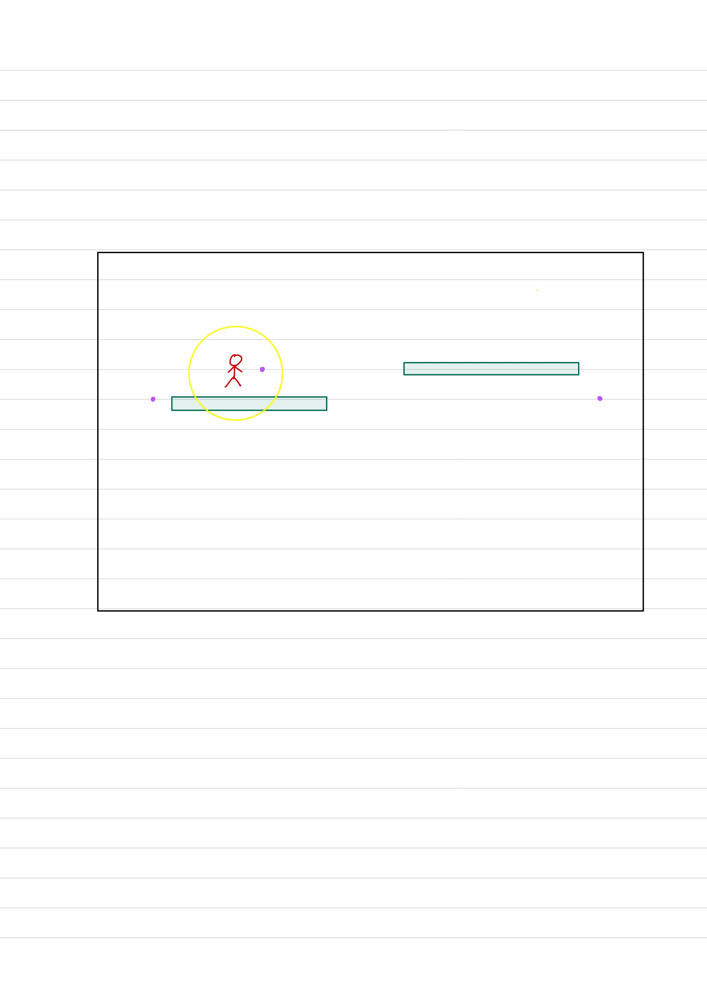

당연하게도, 이해하지않고 붙여넣은 코드는 고칠 수 없다.

이해안됬는데 일단 빨리 해보고나서 이해하는게 시간이 단축되니까 일단해보려고햇는데

안되서 개빢

일단, 

Mathf.Clamp(preferential value, min value, max value)

prefer가 min보다 크고 max보다 작으면 prefer을 반환한다.

그래서, min과 max로 맵의 범위를 정의하고, prefer에는 캐릭터의 위치를 주어 카메라가 맵밖으로 나가지않도록, 캐릭터를 따라다니도록 하는 원리. 

Vector3 desiredPosition = new Vector3(  
            Mathf.Clamp(swordManTs.position.x + offset.x, limitMinX + cameraHalfWidth, limitMaxX - cameraHalfWidth),  
            Mathf.Clamp(swordManTs.position.y + offset.y, limitMinY + cameraHalfHeight, limitMaxY - cameraHalfHeight),  
            -10);

transform.position = Vector3.Lerp(transform.position, desiredPosition, Time.deltaTime \* smoothSpeed);

offset은 선택사항이다. 캐릭터를 카메라의 정 중앙에 위치시킬지, 한쪽으로 치우치게 만들지.

https://hoil2.tistory.com/31?category=857730

내가 보던 예제에서는 clamp가 중간값이라고해서 평균인줄... 그래서 게속 못고치고있었다.

아래 글 보고 깨달음

[https://asix.tistory.com/3](https://asix.tistory.com/3)

그림그리니까 아차 싶음

