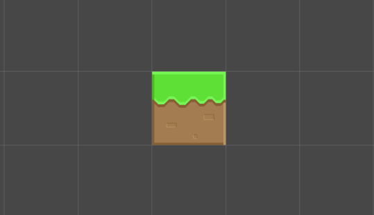

나는 유닛이 뭔지도 몰랐고, 

몇년동안 3d모델링을 하면서 길이, 좌표, 벡터 등을 다루면서 익숙했던 단위는 mm였다. 

float distBetwColumn = Vector3.Distance(columnA, columnB);

Debug.Log("간격을 얼마로 설정했나요? : " + distBetwColumn): // 50000

이라면, 간격은 50000mm 인 셈. 

하지만 유니티를 하면서, 

유니티에서는 유닛과 픽셀 이라는 단위를 쓴다는걸 알았다. 

거기에 더해, 1유닛을 실제(가상세계)에서 몇m과 대등하게 취급할지 에 대한 설정도 할 수 있다고. 

각설하고, 

1유닛 = 씬에서 격자 한칸의 모서리 길이. 

canvas 의 옵션인 reperence pixel per unit 은 1유닛에 몇 픽셀을 할당할 것인지?

256x256그림을 reperence pixel per unit = 100 해놓고 띄우면 씬에서는 두칸반을 차지할테고, 256으로 해놓고 보면 씬에서 딱 한칸에 맞게 들어간다. 

reperence pixel per unit 외에 2개 정도 더 옵션이 있지만, 옵션에 따라 어떻게 달라지는 지 는 아직 노관심. 

중요한건, 

만약 유니티 3d에서 어느 두 변수간의 vector3.distance가 100이 나왔다면, 이는 픽셀단위인가 유닛단위인가 뭔가 내가어떻게아는가?

그걸 알아야 월드와 스크린간에 변환해서 내가 원하는데로 re-positioning 해줄 수 있을텐데. 나중에 알게되면 이 밑에 이어서 작성하겠다. 

월드, 스크린 모두 단위는 픽셀.

유닛은, 설정에 따라 픽셀단위-가변적 nomorized길이 를 갖는듯.
